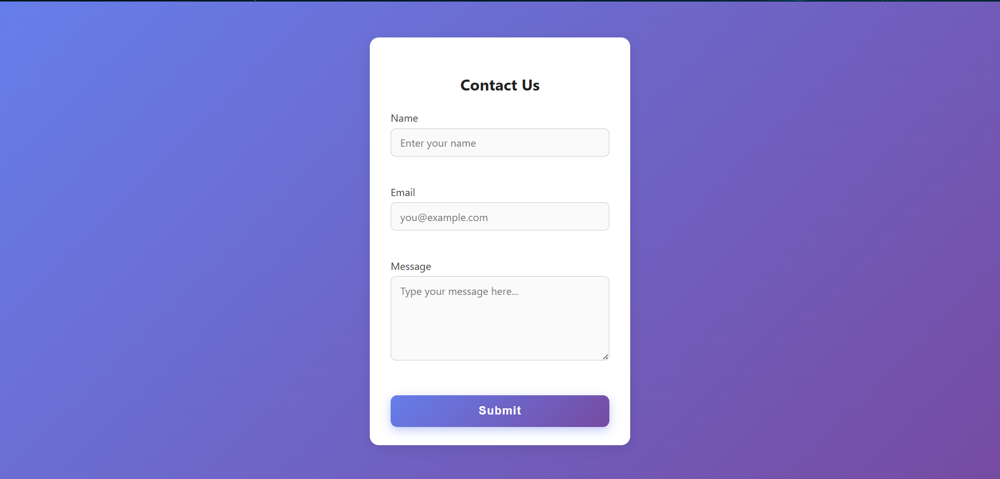
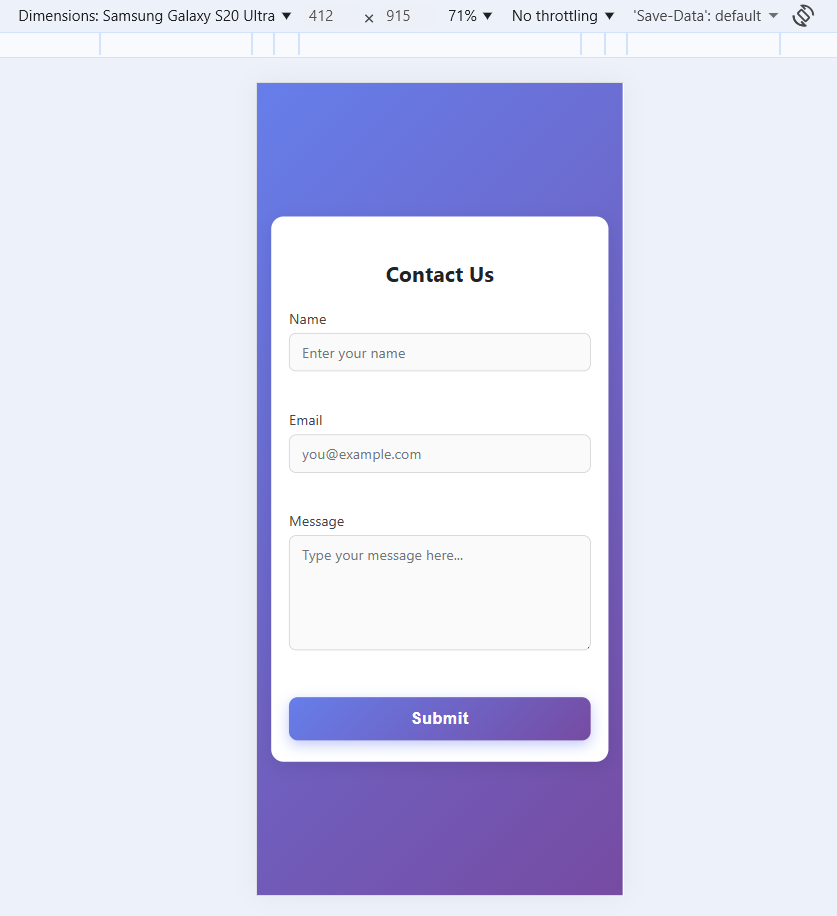

# Contact Form 

A simple, clean contact form using HTML, CSS, and JavaScript with validation ✅.

---

## 📝 Features

- **Responsive & Centered** layout 🎯
- **Stylish design** with gradients, shadows, and rounded corners ✨
- **Hover & focus effects** with smooth animations 🌟
- **Validation**: Checks for empty fields and valid email ✉️
- **Error messages** appear in red ❌
- **Success message** in green ✅
- **Form clears** after submission ✨

---

## 📷 Screenshots

| Desktop View                | Mobile View                  |
|-----------------------------|------------------------------|
|  |    |

---

## 🚀 How to Use

1. Open `index.html` in your browser 💻
2. Fill in your details → **Name**, **Email**, and **Message** ✍️
3. Click **Submit** to see validation in action! 🚦
4. Fix errors highlighted in red if any ❗️
5. Receive confirmation ✨

---
📂 Project Structure
```
contact-form/
│
├── assets/
|   ├── desktop.png
|   └── mobile.png
├── index.html
├── script.js
└── style.css
```
---

## 🌟 Tips

- Use a modern browser like Chrome 🖥️
- Customize styles or validation rules to fit your needs 🎯
- Feel free to enhance further! 🚀

---

## 🤝 Want to contribute?

Feel free to fork, improve, or adapt this project! 👍

---
